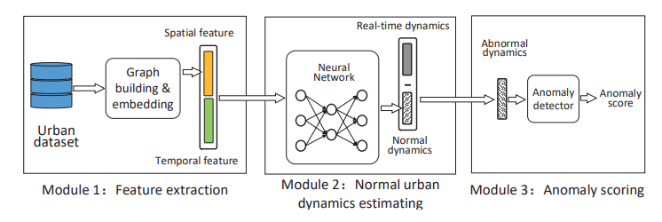

# A decomposition approach for urban anomaly detection across spatiotemporal data(IJCAI 19)

原文 : <https://helda.helsinki.fi/bitstream/handle/10138/322519/0837.pdf?sequence=1>



- 抽取时间数据（天气、星期和时段）和空间数据（使用WordVec进行图嵌入）；
- 将时空数据通入全连接神经网络，训练目标是预测损失和平滑损失；
- 求出异常分量后LOF进行异常检测。

神经网络结构：


## 复现

我们借助了[作者](https://github.com/mingyangzhang/A-Decomposition-Approach-for-Urban-Anomaly-Detection-Across-Spatiotemporal-Data)提供的数据、数据处理模块和图嵌入模块，对网络用PyTorch进行重写，并进行实验（运行程序前先解压`data`中的文件夹）：

```bash
python main.py --weight 3 --epochs 100 --lr 0.01 --gen_data True
```

我们的实验效果：


对应原论文中的第二列，可见复现得到了预期效果。


