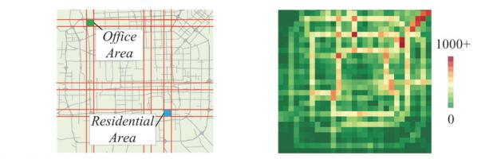
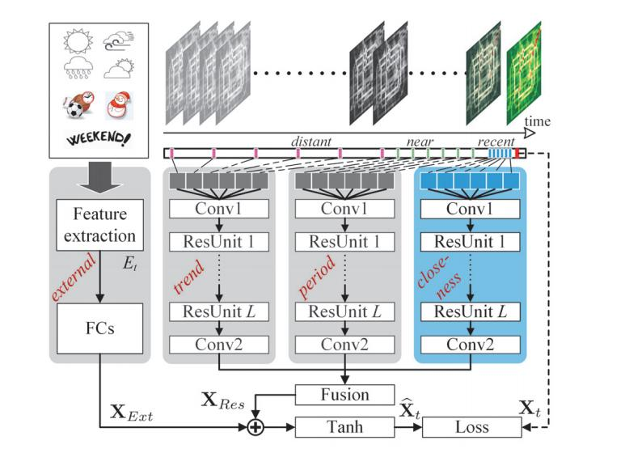
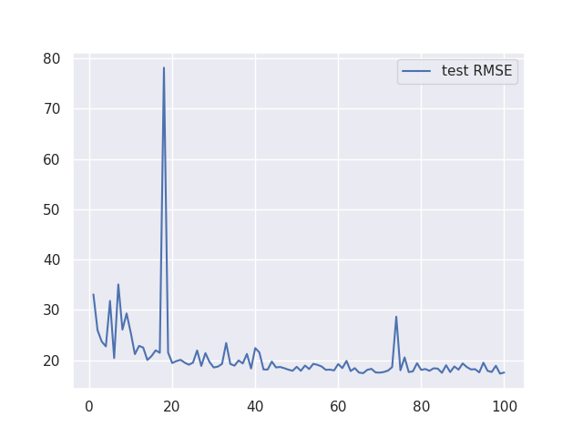

# Deep Spatio-Temporal Residual Networks for Citywide Crowd Flows Prediction (AAAI17)

原文 : <https://www.aaai.org/ocs/index.php/AAAI/AAAI17/paper/viewPaper/14501>.

将地区抽象成Grid Map



用时空数据构建残差神经网络来进行流量预测：



## 复现

Github上的实现几乎都是基于Keras或TensorFlow，这里提供可读性更好的PyTorch版本实现。

```bash
python main.py -h
```

获取程序可调整参数信息，

```bash
unzip -d data/TaxiBJ data/TaxiBJ/TaxiBJ.zip # 解压数据集
pip install -r requirements.txt # 安装第三方库依赖
python main.py
```

运行Baseline，即L3-E（100轮，不采用BN，3个残差单元），在测试集上的表现：



最后达到17.57的RMSE。论文中的实验结果：其中最后一行是我们的结果

| Model  |                Remark                 | RMSE  |
| :----: | :-----------------------------------: | :---: |
| DeepST |           No residual units           | 18.18 |
|  L2-E  | 2 residual units + external influence | 17.67 |
|  L4-E  | 4 residual units + external influence | 17.51 |
|  L3-E  | 3 residual units + external influence | 17.57 |

比较符合官方的实验结果。
